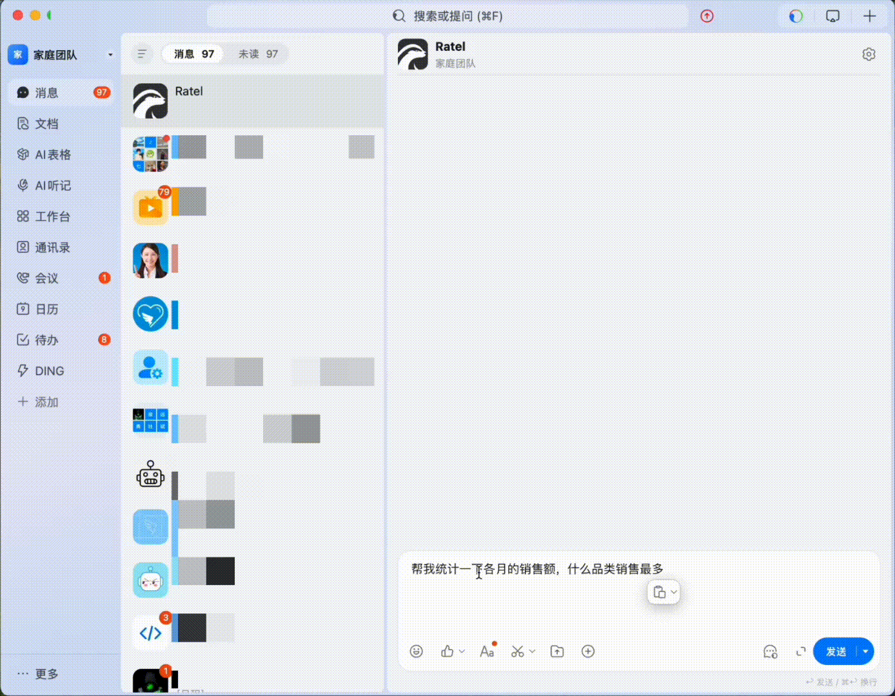

# Ratel

[](https://openjdk.org/)
[](https://spring.io/projects/spring-boot)
[](LICENSE)

**Ratel 是一个管理系统智能体脚手架。**

它的目标不是做一个只能聊天的 AI 助手，而是让 AI 真正进入管理系统，具备可执行、可约束、可审计的业务操作能力。你仍然按照传统管理系统的方式开发页面、接口、权限和业务模块，系统便可以在此基础上持续获得智能体能力，无需额外再造一套 AI 专用后台。

Ratel 重点解决的是企业落地 AI 时最难的矛盾：

- 既希望 AI 能真正操作业务，而不只是回答问题
- 又必须保证权限边界清晰，危险操作可审批，可追踪，可追责
- 还要支持远程接入场景，让 AI 能在飞书、钉钉等入口中代表用户完成实际操作

## 项目价值

### 1. 传统管理系统开发方式不变

Ratel 不要求你为了接入 AI 重写前端，也不要求把系统改造成一个全新的 Agent 产品。业务页面、表单、按钮、权限、数据库模型仍然按常规企业级管理系统方式建设，AI 能力直接建立在这些现有资产之上。

这意味着：

- 已有管理系统的沉淀可以复用
- 前后端团队不需要学习一套完全不同的开发范式
- 系统功能越完整，AI 可调用、可执行的能力就越强

### 2. AI 可以真正执行，而不是停留在问答层

Ratel 的智能体不只是做知识问答，而是可以直接参与业务流程：

- 操作前端界面
- 查询数据库并生成结果
- 输出图表、报表、卡片等可视化内容
- 通过远程入口接收任务并执行

这让 AI 从“辅助说明”变成“可交付结果的执行者”。

### 3. 把 AI 放进真实业务之前，先把安全边界做好

Ratel 默认将安全和治理能力放在与执行能力同等重要的位置。系统内置权限控制、危险操作审批、字段和数据范围限制、操作日志等机制，确保 AI 做得到的事情，也必须是它被允许做的事情。

核心原则很简单：

- AI 只能在权限范围内行动
- 敏感操作必须经过审批
- 关键过程必须可审计
- 远程操作也必须沿用同一套安全边界

## 项目演示

### 界面控制

AI 可直接操作前端界面，实现从理解需求到执行动作的闭环。


### 可视化输出

AI 可根据上下文自动生成图表、报表、统计卡片等可视化结果。


### 远程操作

系统可对接钉钉、飞书等远程入口，让 AI 在移动端场景下发起并完成业务操作。



## 核心优势

- **管理系统智能体脚手架**：不是单纯聊天界面，也不是孤立的 Agent Demo，而是可直接承载企业管理系统开发的工程化底座
- **传统开发即可增强 AI 能力**：页面、接口、权限、业务模型按常规方式建设，AI 自动获得可理解、可执行、可组合的操作能力
- **真正支持远程操作**：不仅能在本地页面中交互，还可以接入飞书、钉钉等场景，把业务操作能力延伸到远程入口
- **全面权限控制**：覆盖接口、按钮、字段、数据行、表模型等多个层面，让 AI 的能力天然受控
- **危险操作审批**：关键动作可进入 Human-in-the-Loop 审批链路，不把高风险决策直接交给模型
- **单体与微服务兼容**：同一套业务代码支持单体应用和分布式微服务两种部署方式

## 核心能力

| 能力 | 说明 | 价值 |
|------|------|------|
| 界面操作（WebTool） | AI 可点击、输入、跳转、滚动、读取页面结构等 | 让 AI 能像真实用户一样完成界面层操作 |
| 数据库查询（DatabaseSearchAgent） | 自然语言转 SQL，并按权限暴露表、字段与数据 | 让 AI 查询结果既可用又安全 |
| 可视化输出（OutputViewAgent） | 生成 Dashboard、图表、统计卡片、表格、流程图等 | 让 AI 的结果不是一段文本，而是可直接消费的业务输出 |
| 主动提问（AskUserQuestion） | 信息不足时由 AI 主动向用户确认 | 降低误判和误操作概率 |
| 人工审批（Human-in-the-Loop） | 敏感动作自动进入审批流程 | 让高风险操作有明确的人类控制点 |
| 远程操作接入 | 对接钉钉、飞书等远程渠道 | 支持移动化、消息化的业务执行场景 |

## 安全与治理

Ratel 的设计重点，不是“让 AI 尽可能多地做事”，而是“让 AI 在可控边界内稳定做事”。

### 权限控制体系

| 维度 | 说明 |
|------|------|
| 接口权限（URL） | 基于 ABAC 表达式控制接口访问，支持角色、时间范围、周期性等动态条件 |
| 按钮权限 | 前端通过 `AuthGate` 组件和 `useAuth` Hook 做按钮级控制 |
| 字段权限（Field） | 控制接口响应中字段可见性，支持 deny 优先策略 |
| 数据权限（DataResource） | MyBatis 拦截器自动追加数据范围条件，支持全部、本部门、本部门及以下、仅本人 |
| 表模型权限（TableModel） | 控制 AI 查询数据库时可访问的表和字段，并支持字段级脱敏 |
| 时效权限 | 支持永久、绝对时间、周期性等权限生效方式 |

### 危险操作审批

当 AI 准备执行敏感动作时，系统可以自动切换到人工审批模式，由用户或授权人员确认后再继续执行。这样既能保留 AI 的执行效率，又不会让高风险动作绕过治理体系。

### 审计与追踪

系统保留统一的操作日志与关键执行链路信息，便于排查问题、审计行为与复盘决策过程。

## 适用场景

- 智能后台管理系统
- 可远程操作的业务中台
- 需要把 AI 落到真实业务执行环节的企业应用
- 对权限、安全、审批有明确要求的管理系统
- 希望在现有管理系统基础上逐步引入智能体能力的项目

## 功能概览

### AI 智能体能力

| 能力域 | 功能 |
|------|------|
| 中央智能体 | 统一调度界面操作、数据库查询、可视化输出、用户提问、审批流程 |
| 界面执行 | 前端 WebTool 执行点击、输入、跳转、读取、滚动等动作 |
| 数据分析 | 将自然语言转为权限感知查询，并返回可用数据结果 |
| 输出生成 | 输出图表、表格、统计卡片、流程图等结果视图 |
| 远程协作 | 通过远程入口接受任务，并在系统内完成业务执行 |

### 业务模块

| 模块 | 功能 |
|------|------|
| 系统管理 | 用户管理、部门管理、组织架构图、仪表盘、个人中心 |
| 安全中心 | 菜单管理、角色管理、数据资源管理、表模型管理、业务功能配置 |
| 文件管理 | 文件上传/下载，支持本地、MinIO、阿里云 OSS、AWS S3 |
| 操作日志 | 全局操作日志记录与查询 |

## 架构概览

Ratel 是一个 Java 后端 + 微前端的全栈项目，支持单体与分布式两种部署模式。

### 后端

- 基于 Spring Boot 4 构建
- 采用多模块 Maven 架构
- 支持单体应用与微服务自动适配
- 通过统一 `@ApiClient` 框架屏蔽本地调用与远程调用差异
- 结合 Spring AI Alibaba、AgentScope、jCasbin、Sa-Token、MyBatis Plus 等构建 AI 与权限底座

### 前端

- 基于 UmiJS 4 + qiankun 微前端
- 主应用承载 AI 聊天、AI 输出面板、AI 操作模式等能力
- 子应用承载各业务模块，保持传统管理系统开发模式
- 共享库 `@gwsu/core` 提供布局、主题、权限、状态管理、文件能力等基础设施

### 部署模式

`DeployInitializer` 会自动检测运行环境：

- 单体模式使用 `LocalApiClientFactory`，以 Bean 查找方式直接调用
- 分布式模式使用 `RemoteApiClientFactory`，通过 HTTP 和熔断机制调用

同一套业务代码无需修改即可在两种模式之间切换。

## 目录结构

```text
ratel/
├── root-pom/                    # 根 POM，依赖与插件管理
├── project-pom/                 # 内部模块版本管理
├── common/                      # 公共基础设施模块
│   ├── common-core
│   ├── common-api
│   ├── common-ai
│   ├── common-cache
│   ├── common-database
│   ├── common-deploy
│   ├── common-security
│   ├── common-authentication
│   └── common-log
├── business/                    # 业务模块
│   ├── business-security/
│   ├── business-system/
│   ├── business-kit/
│   ├── business-log/
│   └── application/
│       ├── single/gwsu
│       └── distributed/
├── web/                         # 前端项目（pnpm workspace）
│   ├── gwsu-core/
│   └── apps/
├── skills/                      # AI 技能定义
└── docker/                      # Docker 部署与初始化脚本
```

## 技术栈

### 后端

| 技术 | 版本         | 说明 |
|------|------------|------|
| Java | 25         | 编程语言 |
| Spring Boot | 4.0.6      | 应用框架 |
| Spring Cloud Alibaba | 2025.1.0.0 | Nacos 注册与配置 |
| Spring AI Alibaba | 1.1.2.2    | LLM 集成 |
| AgentScope | V2         | Agent 框架 |
| MyBatis Plus | 3.5.16     | ORM 与多数据源 |
| Redisson | 4.3.0      | Redis 客户端 |
| jCasbin | 1.99.0     | ABAC 权限控制 |
| Sa-Token | 1.45.0     | 认证框架 |
| Resilience4j | 2.4.0      | 熔断降级 |

### 前端

| 技术 | 版本 | 说明 |
|------|------|------|
| React | 19.2.0 | UI 框架 |
| UmiJS | 4.0 | 企业级前端框架 |
| Ant Design | 6.3.4 | UI 组件库 |
| CopilotKit | 1.56.2 | AG-UI 协议集成 |
| qiankun | - | 微前端框架 |
| Zustand | 5.0.13 | 状态管理 |
| ECharts | 6.1.0 | 图表能力 |
| pnpm workspace | - | Monorepo 管理 |

## 部署环境

| 依赖 | 版本 | 说明 |
|------|------|------|
| JDK | 25+ | 后端编译运行 |
| Maven | 3.9+ | 后端构建 |
| Node.js | 18+ | 前端构建 |
| pnpm | 10.32+ | 前端包管理 |
| PostgreSQL | 14+ | 主数据库（或 MySQL） |
| Redis | 6.0+ | 缓存、会话、策略同步 |
| Nacos | 2.x | 注册配置中心（仅分布式模式） |
| Docker | 20+ | 容器化部署（可选） |

## 启动方式

### 方式一：Docker 一键部署（推荐）

```bash
# 克隆项目
git clone https://github.com/1120665184/ratel.git
cd ratel

# 一键启动
sh docker/start-single.sh
```

脚本会自动完成：

1. 检查 Maven、Node.js、pnpm、Docker 运行环境
2. 构建后端 JAR
3. 构建前端主应用与子应用
4. 通过 Docker Compose 启动 PostgreSQL、Redis 与 Ratel

启动后访问 `http://localhost` 即可。

首次登录后，需要进入 **设置 -> 模型配置 -> LLM模型**，完成模型服务配置后方可启用 AI 智能体能力。

### 方式二：本地开发模式

先确保 PostgreSQL 与 Redis 已启动。

#### 1. 构建后端

```bash
# 安装 POM 依赖管理
mvn clean install -f project-pom/pom.xml

# 安装根模块
mvn clean install -f root-pom/pom.xml

# 安装公共模块
mvn clean install -DskipTests -f common/pom.xml

# 安装业务模块
mvn clean install -DskipTests -f business/pom.xml

# 启动单体应用（默认端口 8888）
mvn spring-boot:run -pl business/application/single/gwsu
```

#### 2. 启动前端

```bash
cd web

# 安装依赖
pnpm install

# 启动主应用（端口 8000）
pnpm dev:main

# 启动系统管理子应用（端口 8001）
pnpm dev:sub-system

# 启动安全中心子应用（端口 8002）
pnpm dev:sub-security
```

### 方式三：分布式微服务模式

```bash
# 1. 确保 Nacos 已启动（127.0.0.1:8848）

# 2. 启动网关
mvn spring-boot:run -pl business/application/distributed/gwsu-gateway

# 3. 启动各业务服务
mvn spring-boot:run -pl business/application/distributed/gwsu-security
mvn spring-boot:run -pl business/application/distributed/gwsu-system
mvn spring-boot:run -pl business/application/distributed/gwsu-headless
mvn spring-boot:run -pl business/application/distributed/gwsu-kit
mvn spring-boot:run -pl business/application/distributed/gwsu-log
```

## 配置说明

### 单体模式配置

配置文件位于 `classpath:` 下：

- `application.yaml`
- `database.yaml`
- `redis.yaml`

### 分布式模式配置

配置从 Nacos 导入：

- `common.yaml`
- `common-redis.yaml`
- `common-database.yaml`
- `{application.name}.yaml`

## Native Image

支持 GraalVM 原生镜像编译：

```bash
mvn -Pnative package -pl business/application/single/gwsu
```

## 联系方式

- 作者：Quyq
- GitHub：[https://github.com/1120665184/ratel](https://github.com/1120665184/ratel)
