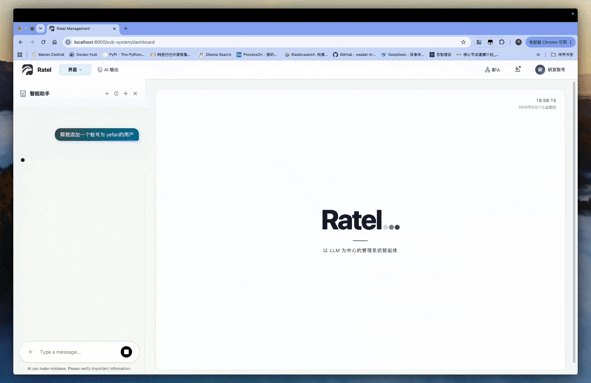
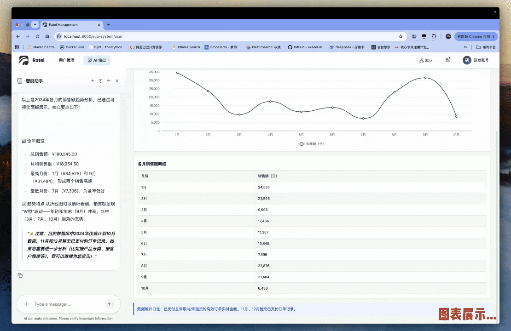

# Ratel

[](https://openjdk.org/)
[](https://spring.io/projects/spring-boot)
[](https://www.apache.org/licenses/LICENSE-2.0)

**以 LLM 为中心的管理系统智能体** — 让 LLM 成为真正的大脑而非助手，LLM 可以干权限范围之内的所有事。

Ratel 基于 Spring Boot 4.0 构建，将 LLM 深度融入管理系统的核心链路。AI 不仅能回答问题，更能直接操作界面、查询数据库、执行业务——一切在权限控制之下。系统支持**单体应用**与**分布式微服务**两种部署模式，无需修改代码即可无缝切换。

## 项目演示

### 界面控制（WebTool）

AI 可直接操作前端界面，实现"说即所得"



### 可视化输出

AI 自动生成图表、报表等可视化组件



## 项目特点

- **以 LLM 为中心** — AI 不是旁观者，而是系统的大脑。通过 WebTool 直接操作前端界面，通过 DatabaseSearchAgent 自然语言查询数据库，通过 OutputViewAgent 生成可视化报表，真正实现"说即所得"
- **Human-in-the-Loop** — 关键操作前自动请求人工审批，AI 的每一步敏感操作都在人类监督之下，安全可控
- **ABAC 权限控制** — 基于 jCasbin 的属性级访问控制，支持角色、时间范围、周期性等动态条件表达式；覆盖接口权限、字段级权限、数据行级权限三个维度
- **单应用/微服务无缝切换** — 同一套业务代码，通过配置即可在单体应用和分布式微服务之间切换部署
- **统一 API 客户端框架** — 类似 OpenFeign 的 `@ApiClient` 注解，自动适配部署模式，单体模式直接调用，微服务模式走 HTTP
- **AG-UI 协议** — 基于 CopilotKit 兼容的 AG-UI 协议，通过 SSE 实现流式通信，支持工具调用、推理过程展示、自定义事件
- **多数据源支持** — 动态数据源切换，支持读写分离
- **微前端架构** — 基于 qiankun 的主子应用架构，子应用独立开发、独立部署、运行时动态挂载
- **Native Image** — 支持 GraalVM 原生镜像编译

## 功能概览

### AI 智能助手（Central Brain）

| 能力 | 说明 |
|------|------|
| 界面操作（WebTool） | AI 可直接操作前端界面：点击按钮、输入文本、路由跳转、滚动页面等 8 种操作 |
| 数据库查询（DatabaseSearchAgent） | 自然语言转 SQL，权限感知——只展示用户有权限的表和字段，支持字段级脱敏 |
| 可视化输出（OutputViewAgent） | 生成 Dashboard、统计卡片、图表、数据表格、流程图等 7 种可视化组件 |
| 主动提问（AskUserQuestion） | 信息不足时 AI 主动向用户提问，而非猜测 |
| 人工审批（Human-in-the-Loop） | 敏感操作自动触发审批流程，用户可批准或拒绝 |

### 权限控制体系

| 维度 | 说明 |
|------|------|
| 接口权限（URL） | ABAC 表达式控制接口访问，支持角色、时间范围、周期性等动态条件 |
| 字段权限（Field） | 控制接口响应中字段的可见性，deny 优先于 allow |
| 数据权限（DataResource） | MyBatis 拦截器自动追加 WHERE 条件，支持全部/本部门及以下/本部门/仅本人四种范围 |
| 表模型权限（TableModel） | 控制 AI 查询数据库时可访问的表和字段，支持字段级脱敏策略 |
| 时效权限 | 角色绑定菜单支持永久/绝对时间/周期性（按周/按月）三种时效配置 |
| 按钮权限 | 前端按钮级权限控制，`AuthGate` 组件 + `useAuth` Hook |

### 业务功能

| 模块 | 功能 |
|------|------|
| 系统管理 | 用户管理、部门管理（含组织架构图）、仪表盘、个人中心 |
| 安全中心 | 菜单管理、角色管理、数据资源管理、表模型管理（含业务功能配置） |
| 文件管理 | 文件上传/下载，支持本地/MinIO/阿里云 OSS/AWS S3 多种存储后端 |
| 操作日志 | 全局操作日志记录与查询 |

## 目录结构

```
ratel/
├── root-pom/                          # 根 POM，依赖和插件管理
├── project-pom/                       # 内部模块版本管理
│
├── common/                            # 公共基础设施模块
│   ├── common-core                    # 核心工具类、领域对象、统一响应 R<T>
│   ├── common-api                     # @ApiClient 统一服务调用框架
│   ├── common-ai                      # AI 基础设施（AG-UI 协议、Agent 框架、Human-in-the-Loop、WebTool）
│   ├── common-cache                   # Redis 缓存封装（Redisson）
│   ├── common-database                # MyBatis Plus、多数据源、数据权限拦截器
│   ├── common-deploy                  # 部署模式配置（单应用/微服务自动适配）
│   ├── common-security                # ABAC 权限控制（Casbin 引擎、字段权限、鉴权过滤器）
│   ├── common-authentication          # 用户认证（Sa-Token）
│   └── common-log                     # 操作日志
│
├── business/                          # 业务模块
│   ├── business-security/             # 安全业务模块
│   │   ├── business-security-api      # 安全服务 API 定义
│   │   └── business-security-server   # 安全服务实现（ABAC 策略、角色/菜单/API 资源/表模型权限、Central Brain）
│   ├── business-system/               # 系统业务模块
│   │   ├── business-system-api        # 系统服务 API 定义
│   │   └── business-system-server     # 系统服务实现（用户、部门）
│   ├── business-kit/                  # 工具业务模块
│   │   ├── business-kit-api           # 工具服务 API 定义
│   │   └── business-kit-server        # 工具服务实现（文件上传/下载）
│   ├── business-log/                  # 日志业务模块
│   │   ├── business-log-api           # 日志服务 API 定义
│   │   └── business-log-server        # 日志服务实现
│   └── application/                   # 应用入口
│       ├── single/gwsu                # 单体应用（所有业务模块打包为一个 JAR）
│       └── distributed/               # 分布式微服务
│           ├── gwsu-gateway           # API 网关
│           ├── gwsu-security          # 安全服务
│           ├── gwsu-system            # 系统服务
│           ├── gwsu-kit               # 工具服务
│           └── gwsu-log               # 日志服务
│
├── web/                               # 前端项目（pnpm workspace）
│   ├── gwsu-core/                     # 共享库（@gwsu/core）
│   │   └── src/                       # stores/auth/user/menu、components/AuthGate/ThemeLayout、hooks、services、utils
│   └── apps/
│       ├── gwsu-main/                 # 主应用（qiankun master）
│       │   └── src/
│       │       ├── components/AIChat/          # AI 聊天面板
│       │       ├── components/AiOutputPanel/   # AI 可视化输出面板
│       │       ├── components/AiModeOverlay/   # AI 操作模式覆盖层
│       │       ├── components/SettingsPanel/   # 设置面板（LLM 配置、字典、附件）
│       │       ├── services/web-tool/          # WebTool 前端执行引擎（DOM 解析、元素操作）
│       │       └── providers/CopilotKitProvider.tsx  # CopilotKit 集成
│       ├── gwsu-sub-system/           # 系统管理子应用
│       │   └── src/pages/
│       │       ├── login/             # 登录
│       │       ├── dashboard/         # 仪表盘
│       │       ├── dept/              # 部门管理
│       │       └── user/              # 用户管理
│       └── gwsu-sub-security/         # 安全中心子应用
│           └── src/pages/
│               ├── menu/              # 菜单管理
│               ├── role/              # 角色管理
│               ├── dataresource/      # 数据资源管理
│               └── tablemodel/        # 表模型管理
│
├── skills/                            # AI 技能定义
│   ├── output-view/                   # 可视化输出技能（7 种组件规范）
│   ├── gwsu-backend-development/      # 后端开发规范技能
│   └── gwsu-view-development/         # 前端开发规范技能
│
└── docker/                            # Docker 部署
    ├── single/                        # 单机版部署
    │   ├── Dockerfile                 # 多阶段构建（JRE + Nginx + 前后端一体）
    │   ├── docker-compose.yml         # PostgreSQL + Redis + Ratel
    │   ├── .env                       # 环境变量配置
    │   └── entrypoint.sh              # 容器启动脚本
    ├── nginx/                         # Nginx 配置
    └── initdb/                        # 数据库初始化脚本
        ├── ddl/                       # DDL（MySQL / PostgreSQL）
        └── dml/                       # DML 初始数据
```

## 技术栈

### 后端

| 技术 | 版本         | 说明 |
|------|------------|------|
| Java | 25         | 编程语言 |
| Spring Boot | 4.0.6      | 基础框架 |
| Spring Cloud | 2025.1.1   | 微服务组件 |
| Spring Cloud Alibaba | 2025.1.0.0 | Nacos 注册配置中心 |
| Spring AI Alibaba | 1.1.2.2    | LLM 集成 |
| AgentScope | 1.1.0-RC2  | Agent 框架（ReAct/HarnessAgent/Skill/Toolkit） |
| MyBatis Plus | 3.5.16     | ORM 框架 |
| Redisson | 4.3.0      | Redis 客户端 |
| jCasbin | 1.99.0     | ABAC 权限控制引擎 |
| Sa-Token | 1.45.0     | 认证框架 |
| Resilience4j | 2.4.0      | 熔断降级 |
| JSQLParser | 5.2        | SQL 解析（数据权限拦截） |
| Apache Tika | 3.3.1      | 文件内容解析 |
| Hutool | 5.8.44     | 工具库 |

### 前端

| 技术 | 版本 | 说明 |
|------|------|------|
| React | 19.2.0 | UI 框架 |
| UmiJS | 4.0 | 企业级前端框架 |
| Ant Design | 6.3.4 | UI 组件库 |
| CopilotKit | 1.56.2 | AI 助手集成（AG-UI 协议） |
| qiankun | - | 微前端框架 |
| Zustand | 5.0.13 | 状态管理 |
| ECharts | 6.1.0 | 图表库 |
| @json-render/react | 0.19.0 | JSON 驱动流式渲染 |
| pnpm workspace | - | Monorepo 管理 |

## 部署环境

### 环境要求

| 依赖 | 版本     | 说明 |
|------|--------|------|
| JDK | 25+    | 后端编译运行 |
| Maven | 3.9+   | 后端构建 |
| Node.js | 18+    | 前端构建 |
| pnpm | 10.32+ | 前端包管理 |
| PostgreSQL | 14+    | 主数据库（或 MySQL） |
| Redis | 6.0+   | 缓存/会话/策略同步 |
| Nacos | 2.x    | 注册配置中心（仅分布式模式） |
| Docker | 20+    | 容器化部署（可选） |

### 基础设施说明

- **PostgreSQL**：主数据库，存储业务数据和权限策略，Docker 部署时自动初始化表结构和基础数据
- **Redis**：缓存、会话管理、Casbin 策略存储与 Pub/Sub 同步、WebTool 执行回调
- **Nacos**：仅分布式微服务模式需要，提供服务注册发现和配置管理
- **Nginx**：前端静态资源服务 + API 反向代理，Docker 部署时内置

## 启动方式

### 方式一：Docker 一键部署（推荐）

使用项目自带的启动脚本，自动构建前后端并启动所有服务：

```bash
# 克隆项目
git clone https://github.com/1120665184/gwsu-basic.git
cd ratel

# 执行一键启动脚本
sh docker/start-single.sh
```

脚本会自动完成：
1. 检查运行环境（Maven、Node.js、pnpm、Docker）
2. 构建后端 JAR
3. 构建前端三个子应用
4. 通过 Docker Compose 启动 PostgreSQL + Redis + Ratel 容器

启动完成后访问 `http://localhost` 即可。

> **首次启动提示**：登录后需进入 **设置 → 助手配置 → LLM 配置**，配置 LLM 服务（如 OpenAI、Anthropic、DashScope、Gemini 等）后方可使用 AI 智能助手功能。

自定义环境变量：

```bash
# 编辑 docker/single/.env
NGINX_PORT=80           # 对外端口
DB_NAME=gwsu            # 数据库名
DB_USERNAME=root         # 数据库用户名
DB_PASSWORD=root         # 数据库密码
REDIS_PASSWORD=redis     # Redis 密码
```

### 方式二：本地开发模式

**1. 启动基础设施**

确保 PostgreSQL 和 Redis 已启动。

**2. 构建后端**

```bash
# 安装 POM 依赖管理
mvn clean install -f project-pom/pom.xml
mvn clean install -f root-pom/pom.xml

# 安装公共模块
mvn clean install -DskipTests -f common/pom.xml

# 安装业务模块
mvn clean install -DskipTests -f business/pom.xml

# 启动单体应用（默认端口 8888）
mvn spring-boot:run -pl business/application/single/gwsu
```

**3. 启动前端**

```bash
cd web

# 安装依赖
pnpm install

# 启动主应用（端口 8000）
pnpm dev:main

# 启动系统管理子应用（端口 8001）
pnpm dev:sub-system

# 启动安全中心子应用（端口 8002）
pnpm dev:sub-security
```

### 方式三：分布式微服务模式

```bash
# 1. 确保 Nacos 已启动（127.0.0.1:8848）

# 2. 启动网关
mvn spring-boot:run -pl business/application/distributed/gwsu-gateway

# 3. 启动各业务服务
mvn spring-boot:run -pl business/application/distributed/gwsu-security
mvn spring-boot:run -pl business/application/distributed/gwsu-system
mvn spring-boot:run -pl business/application/distributed/gwsu-kit
mvn spring-boot:run -pl business/application/distributed/gwsu-log
```

## 配置说明

### 单体模式配置

配置文件位于 `classpath:` 下：

- `application.yaml` — 应用配置
- `database.yaml` — 数据库配置
- `redis.yaml` — Redis 配置

### 分布式模式配置

配置从 Nacos 导入：

- `common.yaml` — 公共配置
- `common-redis.yaml` — Redis 配置
- `common-database.yaml` — 数据库配置
- `{application.name}.yaml` — 应用专属配置

## Native Image 编译

支持 GraalVM 原生镜像编译(计划中)：

```bash
mvn -Pnative package -pl business/application/single/gwsu
```

## 许可证

本项目基于 [Apache License 2.0](LICENSE) 许可证开源。

## 联系方式

- 作者：Quyq
- GitHub：[https://github.com/1120665184/ratel](https://github.com/1120665184/ratel)
