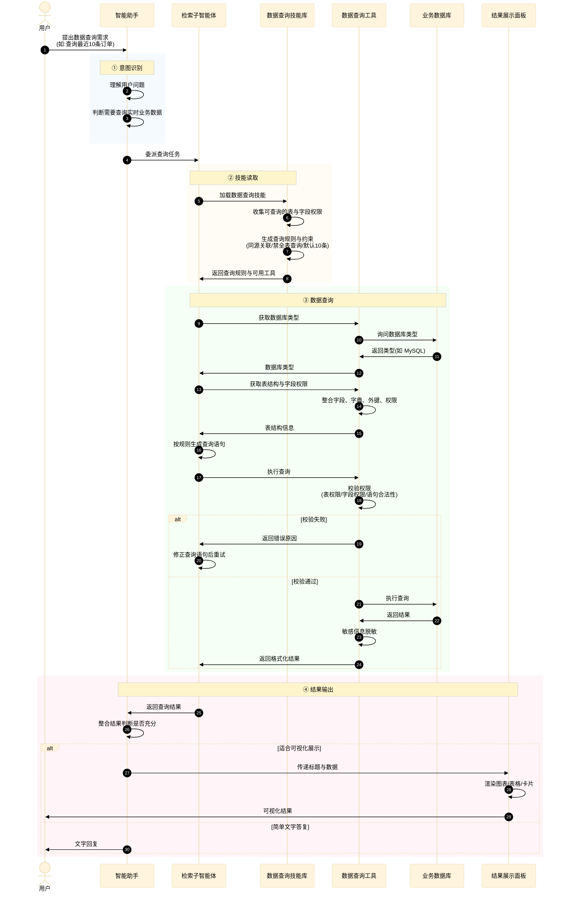

# 智能助手数据库检索流程

```mermaid
%%{init: {'theme': 'base', 'themeVariables': { 'lineColor': '#000000', 'textColor': '#000000', 'primaryTextColor': '#000000', 'noteBkgColor': '#fff5cc', 'noteTextColor': '#000000', 'noteBorderColor': '#cccccc'}}}%%
sequenceDiagram
    autonumber
    actor 用户
    participant 助手 as 智能助手
    participant 子智能体 as 检索子智能体
    participant 技能库 as 数据查询技能库
    participant 查询工具 as 数据查询工具
    participant 数据库 as 业务数据库
    participant 展示面板 as 结果展示面板

    用户->>助手: 提出数据查询需求<br/>(如:查询最近10条订单)

    rect rgb(245, 250, 255)
        Note over 助手: ① 意图识别
        助手->>助手: 理解用户问题
        助手->>助手: 判断需要查询实时业务数据
    end

    助手->>子智能体: 委派查询任务

    rect rgb(255, 252, 245)
        Note over 子智能体,技能库: ② 技能读取
        子智能体->>技能库: 加载数据查询技能
        技能库->>技能库: 收集可查询的表与字段权限
        技能库->>技能库: 生成查询规则与约束<br/>(同源关联/禁全表查询/默认10条)
        技能库->>子智能体: 返回查询规则与可用工具
    end

    rect rgb(245, 255, 245)
        Note over 子智能体,数据库: ③ 数据查询
        子智能体->>查询工具: 获取数据库类型
        查询工具->>数据库: 询问数据库类型
        数据库->>查询工具: 返回类型(如 MySQL)
        查询工具->>子智能体: 数据库类型

        子智能体->>查询工具: 获取表结构与字段权限
        查询工具->>查询工具: 整合字段、字典、外键、权限
        查询工具->>子智能体: 表结构信息

        子智能体->>子智能体: 按规则生成查询语句

        子智能体->>查询工具: 执行查询
        查询工具->>查询工具: 校验权限<br/>(表权限/字段权限/语句合法性)
        alt 校验失败
            查询工具->>子智能体: 返回错误原因
            子智能体->>子智能体: 修正查询语句后重试
        else 校验通过
            查询工具->>数据库: 执行查询
            数据库->>查询工具: 返回结果
            查询工具->>查询工具: 敏感信息脱敏
            查询工具->>子智能体: 返回格式化结果
        end
    end

    rect rgb(255, 245, 248)
        Note over 助手,展示面板: ④ 结果输出
        子智能体->>助手: 返回查询结果
        助手->>助手: 整合结果判断是否充分
        alt 适合可视化展示
            助手->>展示面板: 传递标题与数据
            展示面板->>展示面板: 渲染图表/表格/卡片
            展示面板->>用户: 可视化结果
        else 简单文字答复
            助手->>用户: 文字回复
        end
    end
```
