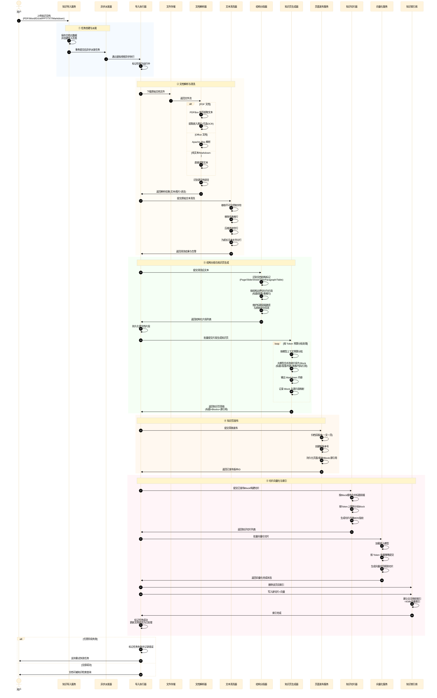

# 知识库文档处理流程

```mermaid
%%{init: {'theme': 'base', 'themeVariables': { 'lineColor': '#000000', 'textColor': '#000000', 'primaryTextColor': '#000000', 'noteBkgColor': '#fff5cc', 'noteTextColor': '#000000', 'noteBorderColor': '#cccccc'}}}%%
sequenceDiagram
    autonumber
    actor 用户
    participant 应用服务 as 知识导入服务
    participant 派发器 as 异步派发器
    participant 执行器 as 导入执行器
    participant 文件存储 as 文件存储
    participant 解析器 as 文档解析器
    participant 清洗器 as 文本清洗器
    participant 分段器 as 结构分段器
    participant 生成器 as 知识页生成器
    participant 发布服务 as 页面发布服务
    participant 切片器 as 知识切片器
    participant 向量化 as 向量化服务
    participant 索引库 as 知识索引库

    用户->>应用服务: 上传知识文档<br/>(PDF/Word/Excel/PPT/TXT/Markdown)

    rect rgb(245, 250, 255)
        Note over 应用服务,派发器: ① 任务创建与派发
        应用服务->>应用服务: 保存文档元数据<br/>并创建导入任务
        应用服务->>派发器: 事务提交后异步派发任务
        派发器->>执行器: 通过虚拟线程异步执行
        执行器->>执行器: 标记任务为运行中
    end

    rect rgb(255, 252, 245)
        Note over 执行器,清洗器: ② 文档解析与清洗
        执行器->>文件存储: 下载原始文档文件
        文件存储->>解析器: 返回文件流

        alt PDF 文档
            解析器->>解析器: PDFBox 按页提取文本
            解析器->>解析器: 提取嵌入图片(可选OCR)
        else Office 文档
            解析器->>解析器: Apache Tika 解析
        else 纯文本/Markdown
            解析器->>解析器: 直接读取文本
        end

        解析器->>解析器: 识别源文档语言
        解析器->>执行器: 返回解析结果(文本/图片/语言)
        执行器->>清洗器: 提交原始文本清洗
        清洗器->>清洗器: 移除不可见控制字符
        清洗器->>清洗器: 移除空表格行
        清洗器->>清洗器: 压缩连续空行
        清洗器->>清洗器: 为超长文本补充分行
        清洗器->>执行器: 返回清洗结果与告警
    end

    rect rgb(245, 255, 245)
        Note over 执行器,生成器: ③ 结构分段与知识页生成
        执行器->>分段器: 提交清洗后文本
        分段器->>分段器: 识别文档结构标记<br/>(Page/Slide/Sheet/Title/Paragraph/Table)
        分段器->>分段器: 按结构边界切分为片段<br/>(标题/段落/表格行)
        分段器->>分段器: 维护标题层级路径<br/>与原始定位信息
        分段器->>执行器: 返回结构化片段列表

        执行器->>执行器: 持久化源文档片段

        执行器->>生成器: 批量提交片段生成知识页
        loop 按 Token 预算分批处理
            生成器->>生成器: 按模型上下文预算分批
            生成器->>生成器: 大模型合并连续片段为 Block<br/>(标题/段落/列表/表格/代码/引用)
            生成器->>生成器: 输出 Markdown 内容
            生成器->>生成器: 记录 Block 与源片段映射
        end
        生成器->>执行器: 返回知识页草稿<br/>(标题+Blocks+源引用)
    end

    rect rgb(255, 248, 240)
        Note over 执行器,发布服务: ④ 知识页发布
        执行器->>发布服务: 提交草稿发布
        发布服务->>发布服务: 归档旧版本(一文一页)
        发布服务->>发布服务: 创建新版本号
        发布服务->>发布服务: 持久化页面/版本/Block/源引用
        发布服务->>执行器: 返回已发布版本ID
    end

    rect rgb(255, 245, 248)
        Note over 执行器,索引库: ⑤ 切片向量化与索引
        执行器->>切片器: 提交已发布Block构建切片
        切片器->>切片器: 按Block顺序合并标题前缀
        切片器->>切片器: 按Token上限拆分长Block
        切片器->>切片器: 生成切片内容MD5指纹
        切片器->>执行器: 返回知识切片列表

        执行器->>向量化: 批量向量化切片
        向量化->>向量化: 加载嵌入模型
        向量化->>向量化: 按 Token 批量策略提交
        向量化->>向量化: 生成向量并回填到切片
        向量化->>执行器: 返回向量化完成状态

        执行器->>索引库: 删除该页旧索引
        执行器->>索引库: 写入新切片+向量
        索引库->>索引库: 建立全文倒排索引<br/>+KNN向量索引
        索引库->>执行器: 索引完成

        执行器->>执行器: 标记任务成功<br/>更新文档状态为已处理
    end

    alt 任意阶段失败
        执行器->>执行器: 标记任务失败并记录错误
        执行器->>用户: 支持重试失败任务
    else 全部成功
        执行器->>用户: 文档可被知识检索查询
    end
```
