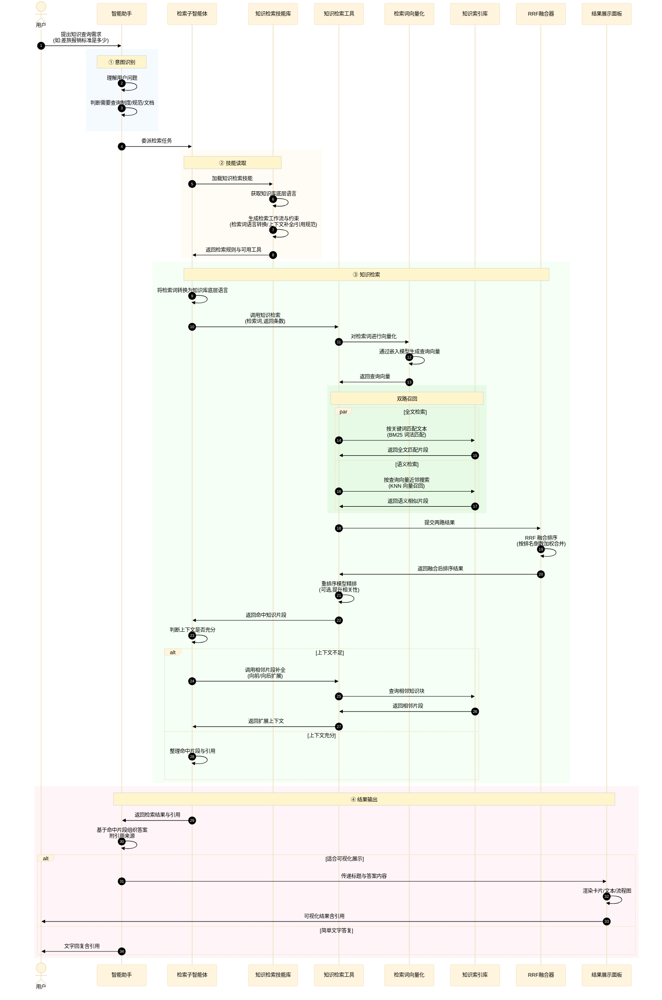

# 智能助手知识库检索流程

```mermaid
%%{init: {'theme': 'base', 'themeVariables': { 'lineColor': '#000000', 'textColor': '#000000', 'primaryTextColor': '#000000', 'noteBkgColor': '#fff5cc', 'noteTextColor': '#000000', 'noteBorderColor': '#cccccc'}}}%%
sequenceDiagram
    autonumber
    actor 用户
    participant 助手 as 智能助手
    participant 子智能体 as 检索子智能体
    participant 技能库 as 知识检索技能库
    participant 检索工具 as 知识检索工具
    participant 向量化 as 检索词向量化
    participant 索引库 as 知识索引库
    participant 融合器 as RRF融合器
    participant 展示面板 as 结果展示面板

    用户->>助手: 提出知识查询需求<br/>(如:差旅报销标准是多少)

    rect rgb(245, 250, 255)
        Note over 助手: ① 意图识别
        助手->>助手: 理解用户问题
        助手->>助手: 判断需要查询制度/规范/文档
    end

    助手->>子智能体: 委派检索任务

    rect rgb(255, 252, 245)
        Note over 子智能体,技能库: ② 技能读取
        子智能体->>技能库: 加载知识检索技能
        技能库->>技能库: 获取知识库底层语言
        技能库->>技能库: 生成检索工作流与约束<br/>(检索词语言转换/上下文补全/引用规范)
        技能库->>子智能体: 返回检索规则与可用工具
    end

    rect rgb(245, 255, 245)
        Note over 子智能体,融合器: ③ 知识检索
        子智能体->>子智能体: 将检索词转换为知识库底层语言

        子智能体->>检索工具: 调用知识检索<br/>(检索词,返回条数)
        检索工具->>向量化: 对检索词进行向量化
        向量化->>向量化: 通过嵌入模型生成查询向量
        向量化->>检索工具: 返回查询向量

        rect rgb(230, 250, 230)
            Note over 检索工具,索引库: 双路召回
            par 全文检索
                检索工具->>索引库: 按关键词匹配文本<br/>(BM25 词法匹配)
                索引库->>检索工具: 返回全文匹配片段
            and 语义检索
                检索工具->>索引库: 按查询向量近邻搜索<br/>(KNN 向量召回)
                索引库->>检索工具: 返回语义相似片段
            end
        end

        检索工具->>融合器: 提交两路结果
        融合器->>融合器: RRF 融合排序<br/>(按排名倒数加权合并)
        融合器->>检索工具: 返回融合后排序结果
        检索工具->>检索工具: 重排序模型精排<br/>(可选,提升相关性)
        检索工具->>子智能体: 返回命中知识片段

        子智能体->>子智能体: 判断上下文是否充分
        alt 上下文不足
            子智能体->>检索工具: 调用相邻片段补全<br/>(向前/向后扩展)
            检索工具->>索引库: 查询相邻知识块
            索引库->>检索工具: 返回相邻片段
            检索工具->>子智能体: 返回扩展上下文
        else 上下文充分
            子智能体->>子智能体: 整理命中片段与引用
        end
    end

    rect rgb(255, 245, 248)
        Note over 助手,展示面板: ④ 结果输出
        子智能体->>助手: 返回检索结果与引用
        助手->>助手: 基于命中片段组织答案<br/>附引用来源
        alt 适合可视化展示
            助手->>展示面板: 传递标题与答案内容
            展示面板->>展示面板: 渲染卡片/文本/流程图
            展示面板->>用户: 可视化结果含引用
        else 简单文字答复
            助手->>用户: 文字回复含引用
        end
    end
```
