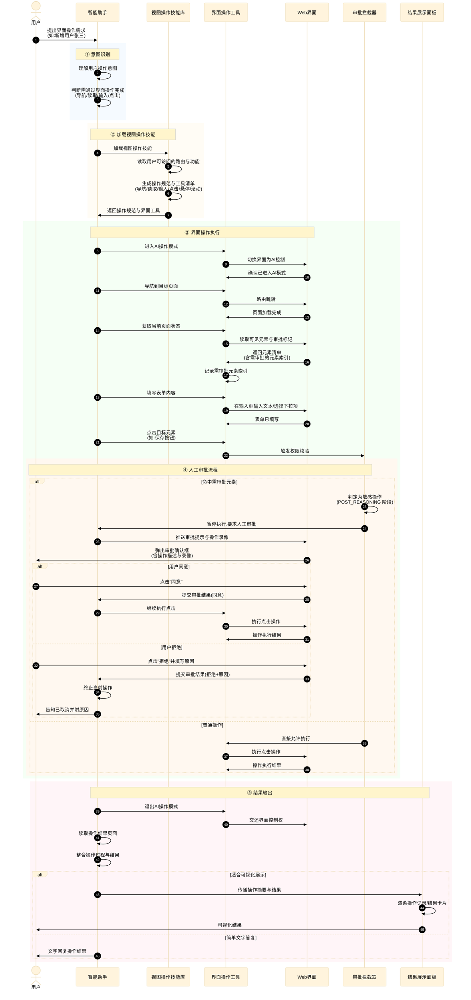

# 智能助手视图操作流程

```mermaid
%%{init: {'theme': 'base', 'themeVariables': { 'lineColor': '#000000', 'textColor': '#000000', 'primaryTextColor': '#000000', 'noteBkgColor': '#fff5cc', 'noteTextColor': '#000000', 'noteBorderColor': '#cccccc'}}}%%
sequenceDiagram
    autonumber
    actor 用户
    participant 助手 as 智能助手
    participant 技能库 as 视图操作技能库
    participant 界面工具 as 界面操作工具
    participant 前端 as Web界面
    participant 审批中间件 as 审批拦截器
    participant 展示面板 as 结果展示面板

    用户->>助手: 提出界面操作需求<br/>(如:新增用户张三)

    rect rgb(245, 250, 255)
        Note over 助手: ① 意图识别
        助手->>助手: 理解用户操作意图
        助手->>助手: 判断需通过界面操作完成<br/>(导航/读取/输入/点击)
    end

    rect rgb(255, 252, 245)
        Note over 助手,技能库: ② 加载视图操作技能
        助手->>技能库: 加载视图操作技能
        技能库->>技能库: 读取用户可访问的路由与功能
        技能库->>技能库: 生成操作规范与工具清单<br/>(导航/读取/输入/点击/悬停/滚动)
        技能库->>助手: 返回操作规范与界面工具
    end

    rect rgb(245, 255, 245)
        Note over 助手,前端: ③ 界面操作执行
        助手->>界面工具: 进入AI操作模式
        界面工具->>前端: 切换界面为AI控制
        前端->>界面工具: 确认已进入AI模式

        助手->>界面工具: 导航到目标页面
        界面工具->>前端: 路由跳转
        前端->>界面工具: 页面加载完成

        助手->>界面工具: 获取当前页面状态
        界面工具->>前端: 读取可见元素与审批标记
        前端->>界面工具: 返回元素清单<br/>(含需审批的元素索引)
        界面工具->>界面工具: 记录需审批元素索引

        助手->>界面工具: 填写表单内容
        界面工具->>前端: 在输入框输入文本/选择下拉项
        前端->>界面工具: 表单已填写

        助手->>界面工具: 点击目标元素<br/>(如:保存按钮)
        界面工具->>审批中间件: 触发权限校验

        rect rgb(255, 248, 240)
            Note over 审批中间件,用户: ④ 人工审批流程
            alt 命中需审批元素
                审批中间件->>审批中间件: 判定为敏感操作<br/>(POST_REASONING 阶段)
                审批中间件->>助手: 暂停执行,要求人工审批
                助手->>前端: 推送审批提示与操作录像
                前端->>用户: 弹出审批确认框<br/>(含操作描述与录像)

                alt 用户同意
                    用户->>前端: 点击"同意"
                    前端->>助手: 提交审批结果(同意)
                    助手->>界面工具: 继续执行点击
                    界面工具->>前端: 执行点击操作
                    前端->>界面工具: 操作执行结果
                else 用户拒绝
                    用户->>前端: 点击"拒绝"并填写原因
                    前端->>助手: 提交审批结果(拒绝+原因)
                    助手->>助手: 终止当前操作
                    助手->>用户: 告知已取消并附原因
                end
            else 普通操作
                审批中间件->>界面工具: 直接允许执行
                界面工具->>前端: 执行点击操作
                前端->>界面工具: 操作执行结果
            end
        end
    end

    rect rgb(255, 245, 248)
        Note over 助手,展示面板: ⑤ 结果输出
        助手->>界面工具: 退出AI操作模式
        界面工具->>前端: 交还界面控制权
        助手->>助手: 读取操作结果页面
        助手->>助手: 整合操作过程与结果
        alt 适合可视化展示
            助手->>展示面板: 传递操作摘要与结果
            展示面板->>展示面板: 渲染操作记录/结果卡片
            展示面板->>用户: 可视化结果
        else 简单文字答复
            助手->>用户: 文字回复操作结果
        end
    end
```
